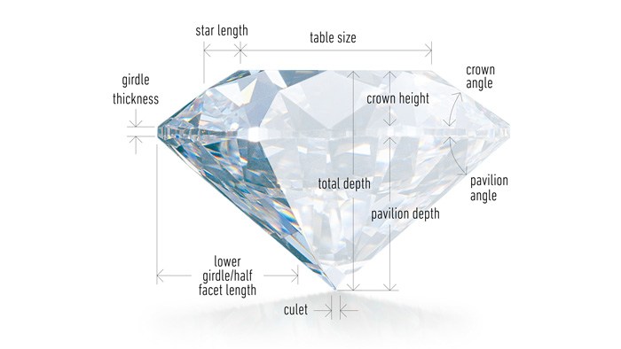

### Hi there welcome to my portfolio </h2>

### [Project 1-1: KPMG Virtual internship project : Sprocket Central Pty Ltd company Customers segmentation & Recommendation project - Data wrangling](https://github.com/Aellawah/Aellawah-Sprocket-Central-Pty-Ltd-company---Customers-Recommendation-project-KPMG-virtual-internship/blob/main/notebooks/KPMG%20internship%20Sprocket%20Central%20Pty%20Ltd%20Company%20Customers%20Recommendation%20Project%20Phase%20%231%20Data%20wrangling.ipynb)
### [Project 1-2: KPMG Virtual internship project : Sprocket Central Pty Ltd company Customers segmentation & Recommendation project - RFM Analysis - Exploratory data analysis](https://github.com/Aellawah/Aellawah-Sprocket-Central-Pty-Ltd-company---Customers-Recommendation-project-KPMG-virtual-internship/blob/main/notebooks/KPMG%20internship%20Sprocket%20Central%20Pty%20Ltd%20Company%20Customers%20Recommendation%20Project%20Phase%232%20Exploratory%26%20RFM%20Data%20analysis.ipynb)
### [Project 1-3: KPMG Virtual internship project : Sprocket Central Pty Ltd company Customers segmentation & Recommendation project - Classification Machine learning Model](https://github.com/Aellawah/Aellawah-Sprocket-Central-Pty-Ltd-company---Customers-Recommendation-project-KPMG-virtual-internship/blob/main/notebooks/KPMG%20internship%20Sprocket%20Central%20Pty%20Ltd%20Company%20Customers%20Recommendation%20Project%20Phase%20%233%20Data%20modeling.ipynb)

This project is a part of a virtual internship from KPMG Company

Sprocket Central Pty Ltd, a medium size bikes & cycling accessories organisation which has a large dataset relating to its customers, but their team is unsure how to effectively analyse it to help optimise its marketing strategy.

* In the first notebook the company provided us with three different datasets it's customers transactions,customers demographics and customers addresses so we conducted a Data wrangling on the three datasets and fixed it's quality issues and eventually joined the three datasets together into one big dataset to start analyzing it and answer client's questions

* In the second notebook we made an Exploratory data analysis on the joined datasets and identfied specific trends , and finally i segmented the customers into Four different segments (Platinum,Gold,Silver,Bronze) throught a RFM analysis

* In the third notebook the client provided us with a new customers dataset and asked to recommend which customer to target with our marketing campagins so we used a classification machine learning model and trained our old labelled data on it and fitted it on the new customers data to predict which one will be which segment.

### [Project 2: Quantium Internship :Chips products data analysis](https://github.com/Aellawah/Quantium-Internship-Chips-products-data-analysis/blob/main/notebooks/Quantium%20Internship%20Module%201%20Chips%20products%20data%20analysis.ipynb)

This project is a part of a virtual internship from Quantium Company

Our client is a company that owns several hypermarkets in the region that sells different types of products, the client wants to better understand the types of customers who purchase Chips and their purchasing behaviour within the region.

* In the first notebook we received two datasets *Transactions dataset & Customers dataset , we have conducted an Exploratory data analysis on the two datasets and provided a conclusion of the business insights.

* For the second notebook the Category Manager for Chips, has asked us to test the impact of the new trial layouts with a data driven recommendation to whether or not the trial layout should be rolled out to all their stores.

### [Project 3: Airline fare prices prediction](https://github.com/Aellawah/Airline-fare-prices-prediction/blob/main/Airline%20prices%20prediction.ipynb)

Passengers want to check for flights fare prices in different airlines according to number of stops during their fights , so throught this dataset which consists of flights information of different airlines we will train our Machine learning model to predict prices for every flight based on specific features that we can reflect to users.

* After wrangling the data we have changed the data columns types to fit our analysis and removed null values records.
* we applied feature engineering on several columns to extract values from them and include them in our machine learning model such as dividing date columns into years months days and seperating categorical columns into seperate values that can be used idividually in our model, used label encoding for ordinal data and hot encoding for nominal data
* we fitted the data after transformation on Random Forest Regressor model which gave us a pretty good results.

### [Project 4: Canadian superstore sales analysis](https://github.com/Aellawah/Canadian-superstore-sales-analysis/blob/main/Canadian%20Superstore%20sales.ipynb)

In this notebook we will explore Data of a canadian superstore that exists in different places around the world and try to gain some insights about the business and the most selling products.

Some of our conclusions was:

* The sales trend over the years is increasing along the from 2011 to 2014
* Customers prefer to use Standard class & Second class as shipping modes
* The most profitable category is Technology & the most profitable sub category is Copiers
* People tend to buy more by the end of the year since the statistics shows that people buy more in the 4th quarter of each year
* The store can make more money when sending products to far areas which requires high cost of shipping 
* Best market per sales is APAC which is Asia pcific markets

### [Project 5: Advetising agency users behavior prediction](https://github.com/Aellawah/Advetising-agency-users-behavior-prediction/blob/main/Advertising%20agency%20dataset.ipynb)

In this project we will be working with an advertising data set, We are trying to enhance the criteria of the customers that we target with our ads so based on specific features about our customers such as Age,income,city,Gender,.. and other features We will create a model that predicts whether or not they will click on an our ads.

* After wrangling our data we found was some outliers in 'Area income' column which we removed them to enhance our model
* We have noticed that older people tend to click more on our ads than youth
* The more the time people spend on internet the likely they click on our ads
* The more the person gets old the less income he gets
* We have fitted our data on a Logistic Regression model and Decision tree classification model

### [Project 6: The Movie database analysis](https://github.com/Aellawah/The-Movie-database-analysis-/blob/main/TMDB.ipynb)

In this notebook, I will investigate the TMDB mavie dataset, The Movie Database (TMDB) is a popular user editable database for movies and TV shows, It has columns for variables such as release year, revenue, budget, director, runtime, and popularity, as well as the IMDB ID for each entry, we have reached alot of conclusions such as:

* we have conluded that people tend to like movies more along the years since the popularity and interest increased from 2005 to 2015 
* Movies are becoming shorter over the time as the statistics shows that the runtime of the movie decreased along the years from 2005 until 2015 
* Revenues from movies are increasing along the years which is also related to popularity of the movies along the years
* Number of movies produced every year increased along the years
* Even though it seems that the revenue is increasing with budget on some level, it is clear that some of the most profitable movies had budgets lower than average.
* It seems that more popular movies produce more revenue. However, some popular movies are not necessarily profitable, and vice versa.

### [Project 8: Diamonds prices prediction](https://github.com/Aellawah/Diamonds-prices-prediction/blob/main/Diamonds%20prices%20prediction.ipynb)

In this notebook, we will try to build a model to predict the prices of diamonds based on various features of diamond like carat weight, cut quality ,etc.
some of the conclusions are:

* After wrangling the data we found that there were no null values in the data ,there were no duplicated rows in the data,There were some outliers in the features which we removed them
* We constructed features engineering on categorical columns in our dataset to utitlize them in our model
* After transforming the data We have fitted the data on a Linear regression model which gave us R2 of 89% 
* We tried to use another model that would enhance the previous results so we used Random Forest Regressor which gave us R2 of 98%

### [Project 8: Udemy courses analysis](https://github.com/Aellawah/Udemy-Dataset/blob/main/Udemy.ipynb)

This Data set contains 3000+ entries for all courses data & subjects in Udemy application which we need to investigate to answer questions about subscribers and courses prices
How many courses for each subject is udemy offering?

Some of our conclusions was:

* Most selling books are for Web development
* These are the Book tites that was published in 2015 Concepts of Statistics For Beginners Step by Step','10 Numbers Every Business Owner Should Know','101 Blues riffs - learn how the harmonica superstars do it', ...,'Your Own Site in 45 Min: The Complete Wordpress Course','Your Second Course on Piano: Two Handed Playing','Zend Framework 2: Learn the PHP framework ZF2 from scratch.
* Maximum number of subscribers is for web develoment subject
* We can interpret from the visual and pearson correlation coefficient value of 0.15 that there is almost no relationship between number of subscribers and number of lectures
* We can interpret from the visual and the pearson correlation coefficient value of 0.051 that there is almost no relationship between increase in the price and increaseinn number of subscribers
* The visual and the pearson correlation of 0.33 shows that here is a moderate relationship between Price and number of lectures which means as the number of lectures increases the price slightly increases

### [Project 9: London housing prices](https://github.com/Aellawah/London-housing-data/blob/main/Londing%20Housing%20Data.ipynb)

This data set contains 13000+ wich is centered around london housing market, it contains alot of additional relevant data related to Averge housing prices , number of houses sold , number of crimes committed
Some of our conclusions was:

* The No. of crimes that happened in different areas freqeunts mostly around 0 crimes the most and very low frequents varies from 1000 to 3000
* The number of houses sold frequents mostly at 0 with the highest frequency and it increases to 20000 with low frequencies
* There is a moderate correlation between average price and year which indicates the increase of prices slightly when along the years.
* There is also a moderate correlation between no. of crimes and years which indicates an increase in the no. of crimes along the years.
* There are 301 Records with zero crimes in England.
* Minimum average price for a utility in England per year is 52,333.
* Maximum Average price for a utility in England per year is 248,515.
* Top 5 areas with hight crimes numbers are barking and dagenham with 2049.0 crimes,barnet with 2893.0 crimes,bexley with 1914.0 crimes,brent with 2937.0 crimes and bromley with 2637.0 crimes.
* Most year that had crimes is 1996 with total of 542 Crimes.
* Least year that had crimes is 2020 with total of 45 Crimes.
